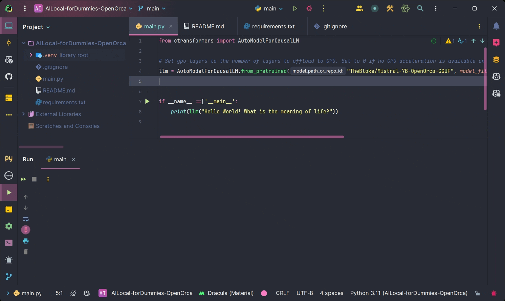

# Local-AI-Open-Orca-For-Dummies



Welcome to **Local-AI-Open-Orca-For-Dummies**, the simplest way to run a Large Language Model (LLM) locally on your machine! No more complex setups, just straightforward AI fun with OpenOrca.

## Installation

Install the `ctransformers` package. Choose the installation command based on your system and GPU availability:

- **No GPU acceleration:**
  ```
  pip install ctransformers
  ```

- **CUDA GPU acceleration:**
  ```
  pip install ctransformers[cuda]
  ```

- **AMD ROCm GPU acceleration (Linux only):**
  ```
  CT_HIPBLAS=1 pip install ctransformers --no-binary ctransformers
  ```

- **Metal GPU acceleration for macOS systems only:**
  ```
  CT_METAL=1 pip install ctransformers --no-binary ctransformers
  ```

## Running the AI

Once you've installed the necessary packages, you can run the `main.py`.

That's it! You're now ready to explore the capabilities of AI running locally on your machine. Enjoy experimenting with OpenOrca and discovering the exciting possibilities of local AI.

## Acknowledgements

This project uses the model provided by [TheBloke/Mistral-7B-OpenOrca-GGUF](https://huggingface.co/TheBloke/Mistral-7B-OpenOrca-GGUF) on Hugging Face.

## License

This project is licensed under the MIT License - see the [LICENSE](LICENSE) file for details.
